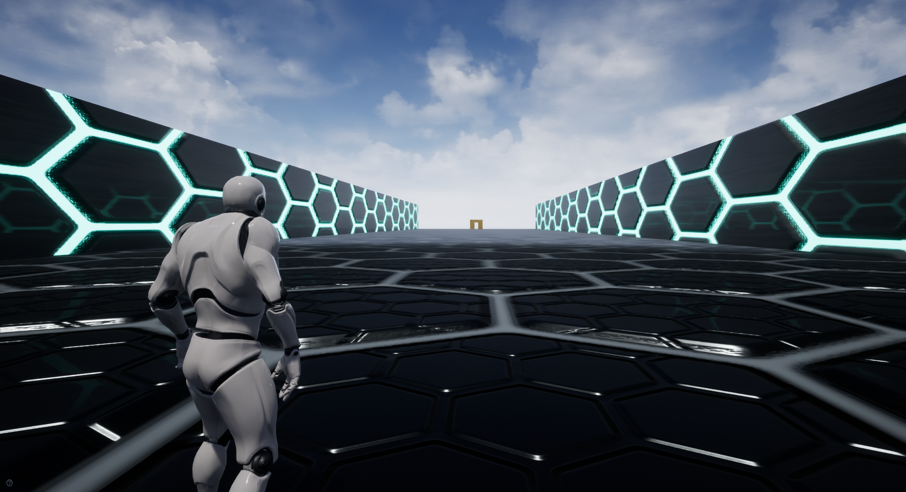

  

## Play

Game page on itch.io: https://guibdbello.itch.io/block-n-run

  

### How to Play

#### Leaping (Third-person)

- **WASD**: Move.
- **Mouse**: Look.
- **Spacebar**: Jump, double jump and wall jump.
- **Shift**: Wall run.

#### Bounding (Isometric)

- **Mouse**: Move.
- **Left mouse button**: Click on the buttons to select a *Bound* and click somewhere on the level to place it.

## About

Parkour versus game. Create Bounds to complicate your opponent's path, and Leap your way out!

### Game Jam

This game was made for the game jam [**Game Off 2019**](https://itch.io/jam/game-off-2019) which took place between November 1st and December 1st of 2019.

Theme: **LEAPS AND BOUNDS**.

## Setup

### Installation

1. Clone repository: `git clone https://github.com/GuiBDBello/Unreliable.git`.
2. Launch Unreal Engine from the Epic Games Launcher.
3. `Browse... > Select the project folder > Open`.

### Development

1. Use Unreal Engine interface to change the levels.
2. Use Unreal Engine interface to edit the Blueprints.

**Obs.:** Some links that may be helpful:

- Documentation: https://docs.unrealengine.com/en-US/index.html
- Get Started With UE4: https://docs.unrealengine.com/en-US/Basics/GettingStarted/index.html

### Build

1. In Unreal Engine, with the project open, go to `File > Build Settings...` then select `Build`.
